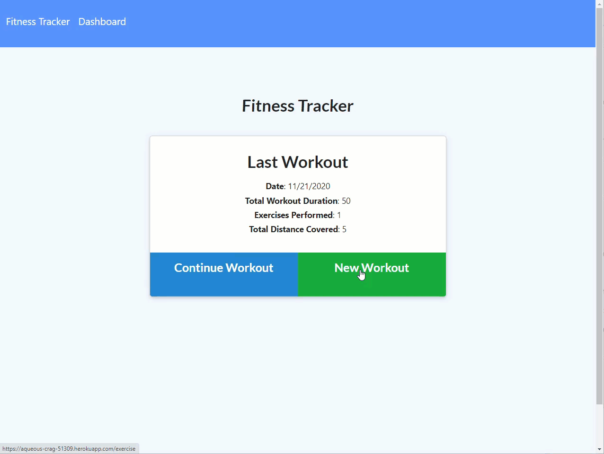

# Exercise Logger

   

## Description

Workout tracker utilizing a Mongo database with a Mongoose schema.

Link to live site: [Exercise Logger](https://aqueous-crag-51309.herokuapp.com/)

## Table of Contents

* [Installation](#installation)
* [Usage](#usage)
* [Contributing](#contributing)
* [License](#license)
* [Questions](#questions)

## Installation
Run `npm init` to install dependencies, and `npm run seed` to add the initial records to the database.

## Usage

Application is invoked with command: `node server.js` or `npm start`.

## License

MIT License

Copyright (c) 2020 Clarissa

## Contributing

When contributing to this repository, please first discuss the change you wish to make via issue, email, or any other method with the owner(s) of this repository before making a change.

## Questions

For any questions the author can be contacted at:

GitHub: @[clarissareeve](https://github.com/clarissareeve)

Email: clarissa.reeve@gmail.com
